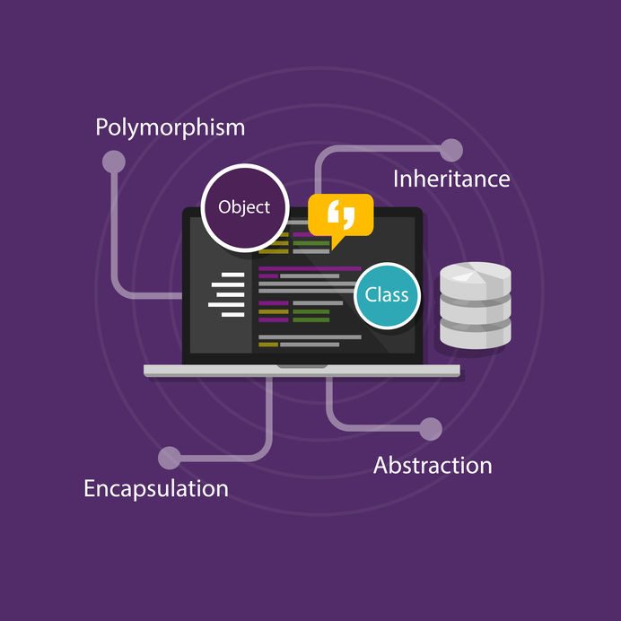
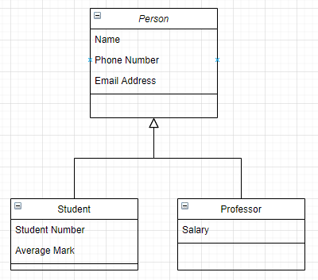
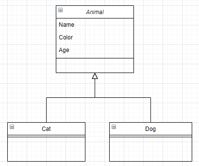

# Table of contents
1. [Introduction](#introduction)
2. [What is OOP?](#paragraph1)
3. [Abstraction](#paragraph2)
4. [Inheritance](#paragraph3)
5. [Encapsulation](#paragraph4)
6. [Polymorphism](#paragraph5)
6. [Wrap up](#paragraph6)

# Introduction <a name="introduction"></a>
In this article, I will talk about the core concepts of object-oriented programming known as **OOP**.
OOP is a programming paradigm that every programmer should understand it because many programming languages are using it.
First, we will define what is OOP, then we will dive in each of The Four Pillars of Object-Oriented Design, which have the wonderful terms – Abstraction, Polymorphism, Inheritance, Encapsulation. One way to remember these is the acronym APIE.


# What is OOP? <a name="paragraph1"></a>
 
OOP is a method of computer programming that involves using 'objects'. An object is essentially a piece of code that lets you create many similar pieces of code without actually re-writing the code each time.  
This is done by first writing a 'class', which is essentially a blueprint of the object. We say the object is a specific instance of the class.
A class can have both methods (or 'functions' - basically, things that every object of that class can do) and properties.
Imagine an object. This can be anything, such as a dog, a bag, a bottle, a car, or any THING.  
Think about what each dog, or each bag, or each bottle, or each car has in common. They can DO things, and they can also have special characteristics to them.
Dogs bark, chase cats and sleep. They can be timid, quiet, loud, big, small. Cars can move, can stop, can contain passengers, can go fast, or slow.  
Object oriented programming is a way to describe what a thing IS and what it can DO.
This programming paradigm is based on 4 fundamental ideas :  
1.	Abstraction  
2.	Polymorphism  
3.	Inheritance  
4.	Encapsulation

One way to remember these is the acronym APIE.
  


# Abstraction <a name="paragraph2"></a>
Abstraction means we must focus on the essential qualities of something rather than one specific example, meaning that we automatically will ignore what is unimportant or irrelevant.  
It is at the heart of object-oriented programming because it is what we are doing while making a class.
Let us take an example for better understanding.
A car is a well-defined object, which is composed of other smaller objects like a wheel system, steering mechanism, engine, which have their own subsystems.  
But for human race a car is a one single object, which can be managed by the help of its subsystems, even if their inner details are unknown.
Another example that coffee lovers will absolutely understand, the coffee machine that you use in your daily life, you don’t need to understand how the internal system is implemented, you have to know the input parameters (money, type of coffee etc …) to trigger a specific action then get the expected output.

# Inheritance <a name="paragraph3"></a>
Whether you are coding in object-oriented way or a procedural way, you should always respect the DRY (Do not Repeat Yourself) principle.
Thanks to Inheritance our code will be reusable, so that we can create a new class but instead of writing it from scratch, it can be based on another existing class that has same properties and methods.
So, let us take an example to clarify this concept:  
  
Supposing that you start with defining the Person class in your application.  
Later on you decide that you need another class for Student objects, and you notice that a Student is in the first place a Person that has another specific properties (Student Number, Average Mark etc…).

So, you must reuse your Person class, by defining a Student class that extends it. In other words, the Student class inherits from the Person class. In the OOP jargon the Person class is the base (parent or super) class of the Student class which is known as child (derive, sub) class.
One of the best things about inheritance is not just time saving and code reusability, but it allows us to use the last key concept, polymorphism.

# Encapsulation <a name="paragraph4"></a>
The idea of keeping fields within a class private, then providing access to them via public methods. It is a protective shield that keeps the data and code safe within the class itself. This way, we can re-use objects without allowing open access to the data system wide.

The encapsulation is the process of wrapping up data and functions to perform actions on the data into single unit. The single unit is called a class. Encapsulation is like enclosing in a capsule. Which means enclosing the related operations and data related to an object into that object. It helps us keeping the data and the code safe from external interference.


# Polymorphism <a name="paragraph5"></a>
Polymorphism is the hardest one to understand and remember.

Polymorphism from the Greek is the ability of an object to take on many forms. The most common use of polymorphism in OOP occurs when a parent class reference is used to refer to a child class object in other words polymorphism basically allows to perform the correct action without knowing what’s going on behind the scenes.

I think it’s not that clear so far so let’s take an example:
  
This class diagram show that Cat and Dog class inherit from the Animal class and add their specific behaviours and characteristics.
Alright, what polymorphism allows us to do is:
```java
Animal[] zoo=new Animal[50]
helloKitty= new Cat()
bullDog= new Dog()
Zoo[0]= helloKitty
Zoo[1] = bullDog
```
So if I want to see that helloKitty is a Cat object it’s correct, and if I want to see it as an Animal object it’s also allowed, depending on the context.

> Polymorphism = Object flexibility.

This is the magic of polymorphism and inheritance duo.

# Wrap up <a name="paragraph6"></a>
I hope that reading this article is helpful to understand those 4 concepts that any developer in the world must understand. I tried to be language agnostic so that anyone could understand. 

### Useful resources:
1. [Great OOP article](https://www.codeproject.com/articles/1059863/the-four-pillars-of-object-oriented-design)
2. [Good talk about APIE](https://www.jakowicz.com/what-is-apie)