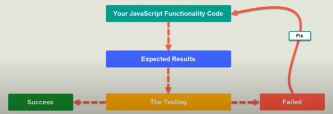
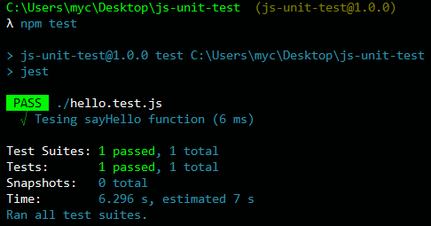
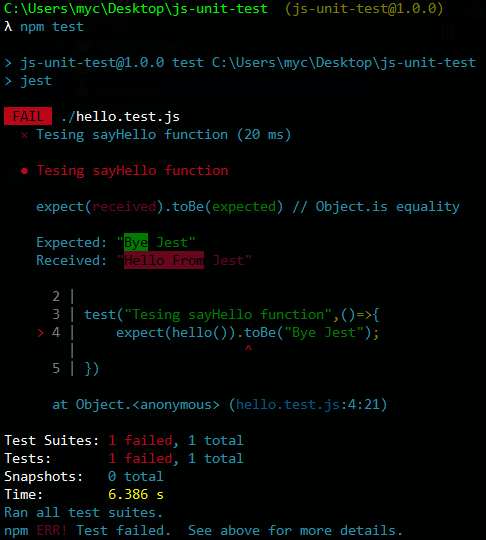

# Table of contents
1. [Introduction](#introduction)
2. [What is Unit Testing ?](#paragraph1)
3. [Testing Cycle](#paragraph2)
4. [Why I need to write unit tests ?](#paragraph3)  
5. [What is Jest ?](#paragraph4)  
6. [Setting up environment and tools](#paragraph5) 
7. [Writing our first unit test with Jest](#paragraph6) 
8. [Rules of the testing game](#paragraph7) 
9. [What is next?](#paragraph8) 

# Introduction <a name="introduction"></a>
Hello folks, in this blog, we will introduce the concept of Unit Testing (What, Why and How) in JavaScript ecosystem, then give some practicle examples
using some JS packages.


# What is Unit Testing <a name="paragraph1"></a>
Unit testing is a software testing method that breaks your software into pieces. Then test each unit in your application to ensure it works and behaves as expected.  
A Unit is the smallest testable piece of any software it can be a Method, a whole class, a whole module or a procedure etc ...  
Unit tests are written and run by the software developers in projects where the possibility of failure should be 0 %.

# Testing Cycle <a name="paragraph2"></a>

First of all, you have to choose which unit you are going to test.
Then you give it some inputs, and run your test.  
If the output is the expected one => Test Succeded  
If the output isn't the expected one => Fix that unit and repeat the test
# Why I need to write unit tests ? <a name="paragraph3"></a>
Unit testing is a MUST while developing some projects that shouldn't fail at any point of time.
We can summarize unit tests objectives in :  
1- Quality of code and design  
2- Finding issues and bugs easily and earlier  
3- Functionality documentation: While writing unit testing you are indirectly documenting your code.
# What is Jest ? <a name="paragraph4"></a>

Jest is a delightful JavaScript Testing Framework with a focus on simplicity developed by Facebook.  
It's zero config: Jest aims to work out of the box, config free, on most JavaScript projects.  
Jest is well documented, well maintained, well good.
# Setting up environment and tools <a name="paragraph5"></a>
1- You need to have NodeJS and NPM installed (LTS). [Download NodeJS (npm came with it)](https://nodejs.org/)  
2- Initializing node js project:
``` sh
mkdir js-unit-test
cd js-unit-test
npm init -y
```
3- Installing Jest package as a development dependency:
``` sh
npm i jest --save-dev
```
4- Open the project with your code editor
# Writing our first unit test with Jest  <a name="paragraph6"></a>
1- Let's create a new file called __hello.js__ in the root of project
``` javascript
const sayHello=()=>{
    return 'Hello From Jest';
}
module.exports=sayHello;
```
2- Create the test file __hello.test.js__ of the hello module 
``` javascript
const hello= require('./hello');

test("Tesing sayHello function",()=>{
    expect(hello()).toBe("Hello From Jest");
});
```
We give our test a name __Testing sayHello function__, calling the __hello__ function, expecting that
the returned value is __Hello From Jest__.  
3- Editing the test property in package.json:
``` json
{
  "name": "js-unit-test",
  "version": "1.0.0",
  "description": "",
  "main": "index.js",
  "scripts": {
    "test": "jest"
  },
  "keywords": [],
  "author": "",
  "license": "ISC",
  "devDependencies": {
    "jest": "^26.1.0"
  }
}
```
4- Open your terminal in the root of project and run:
```sh
npm test 
```
5- If the test succeded the terminal output would be:
  
6- If the test failed the terminal output would be:


# Rules of the testing game <a name="paragraph7"></a>

Uncle Bob defines Test Driven Development with three rules:
>> You are not allowed to write any production code unless it is to make a failing unit test pass.  

>> You are not allowed to write any more of a unit test than is sufficient to fail; and compilation failures are failures.  

>> You are not allowed to write any more production code than is sufficient to pass the one failing unit test.

# What is next?  <a name="paragraph8"></a>
In this article, we have seen the definition of unit testing, why we need it, and finally we run our first test using Jest framework.
The next step is to get a deep understanding of Jest methods. Then add Jest to some existing side projects so that you can practice it more.
Then move on to some assertion libraries like [ChaiJS](www.chaijs.com).
# Useful resources:
1. [Jest official website](https://jestjs.io/)
2. [Jest cheat sheet](https://devhints.io/jest)